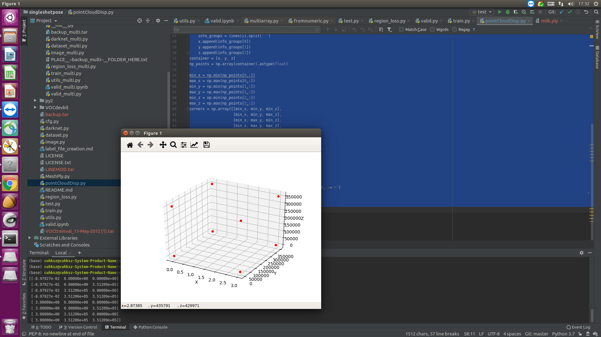

# singleshotpose - upgraded experimental version
### 原项目信息
#### Real-Time Seamless Single Shot 6D Object Pose Prediction
paper: https://arxiv.org/abs/1711.08848 <br>
code repository: https://github.com/microsoft/singleshotpose

### 单图检测使用方法
查看文件:https://github.com/a2824256/singleshotpose_imp/blob/master/singleGraphEstimate.py <br>
新的运行函数
```python
# 数据配置文件
datacfg = 'cfg/ape.data'
# cfg文件配置网络结构
modelcfg = 'cfg/yolo-pose.cfg'
# 权重备份
weightfile = 'backup/ape/model_backup.weights'
# 图片的路径
picfile = 'LINEMOD/ape/JPEGImages/000010.jpg'
# label的路径
labelfile = 'LINEMOD/ape/labels/000010.txt'
valid(datacfg, modelcfg, weightfile, picfile, labelfile)
```

### .ply点云-散点数据格式
索引:数据类型
```
# 0-2:vertices 3-5:normals 6-8:colors
-0.02522185 0.03090663 0.5529081 2.590789 3.252072 4.526592 75 72 54 255 
```
### 修改后的点云八角绘制线段顺序
```
# 1，后左下，2。后左上，3.后右下，4.后右上，5.前左下，6.前左上，7.前右下，8前右上
# 前4组前后两组顶点对齐，中4组后4顶点连接，后4组前4顶点连接
edges_corners = [[1, 5], [2, 6], [3, 7], [4, 8],
                     [1, 2], [1, 3], [2, 4], [3, 4],
                     [5, 6], [5, 7], [6, 8], [7, 8]]
```


### Iterations、Epoch、Batch、Batch Size之间的关系
Epoch: 所有的数据送入网络中完成一次前向计算及反向传播的过程。<br>
Batch: 通常训练的数据量都会挺大，为了减少设备内存负荷，通常都会把数据集切分，一份就是一个batch。<br>
Batch size: 训练样本个数 <br>
Iterations: 完成一次epoch所需的batch个数。

### TODO List
1. 获取点云的8个角标代替原算法获取网格8个角标的方式

### 更新记录
#### 2020/02/14
1. 修改过的singleshotpose源码支持在最新版的pytorch上运行

##### 修改记录
utils.py 242: 
```python
# Softmax语法更新
cls_confs = torch.nn.Softmax(dim=1)(Variable(output[2*num_keypoints+1:2*num_keypoints+1+num_classes].transpose(0,1))).data
```
valid.ipynb 133:
```python
# 语法更新需搭配torch.no_grad()使用
with torch.no_grad():
    data = Variable(data)
```
 
#### 2020/02/18
1. 解决scipy库过时问题
```shell script
conda install scipy=1.2.1
```

2. 新建singleGraphEstimate.py文件来实现单图预估？or整个流程改为对单图实现？
3. 解决运行后的valid.ipynb文件过大无法上传到github的问题<br>
解决方法：jupyter notebook网页 -> Cell -> All Output -> Clear

#### 2020/02/20
1. 解决调试途中线程退出问题

#### 2020/02/21
1. 完成单图检测，使用方法查看使用教程

#### 2020/03/27
1. 更新获取3d点云8个角点的方法，文件为根目录的pointCloudDisp.py

### Valid
验证集与测试集的比对与运行结果<br>


### 获取点云8个角点

