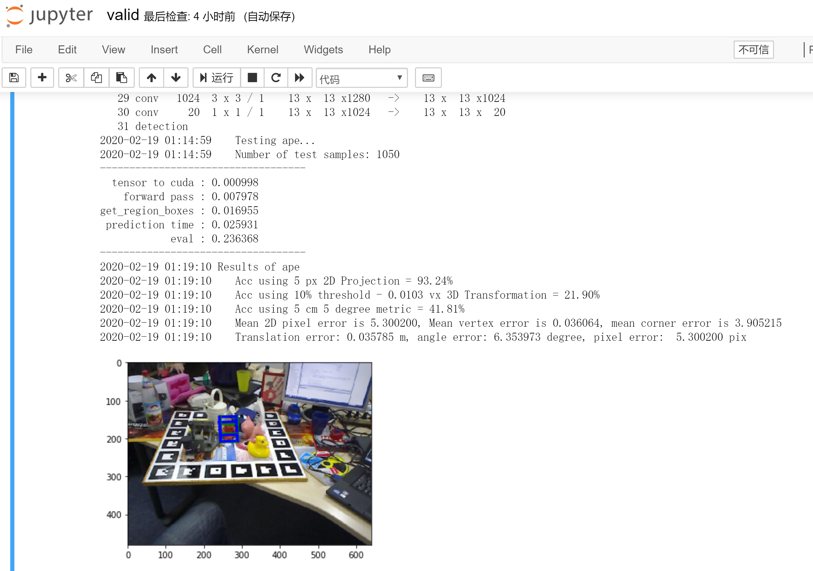

# singleshotpose - upgraded experimental version
### 原项目信息
#### Real-Time Seamless Single Shot 6D Object Pose Prediction
paper: https://arxiv.org/abs/1711.08848 <br>
code repository: https://github.com/microsoft/singleshotpose

### Iterations、Epoch、Batch、Batch Size之间的关系
Epoch: 所有的数据送入网络中完成一次前向计算及反向传播的过程。<br>
Batch: 通常训练的数据量都会挺大，为了减少设备内存负荷，通常都会把数据集切分，一份就是一个batch。<br>
Iterations: 完成一次epoch所需的batch个数。

### 更新记录
#### 2020/02/14
1. 修改过的singleshotpose源码支持在最新版的pytorch上运行
##### 修改记录
utils.py 242:
```python
# Softmax语法更新
cls_confs = torch.nn.Softmax(dim=1)(Variable(output[2*num_keypoints+1:2*num_keypoints+1+num_classes].transpose(0,1))).data
```
valid.ipynb 133:
```python
# 语法更新需搭配torch.no_grad()使用
with torch.no_grad():
    data = Variable(data)
```
 
#### 2020/02/18
1. 解决scipy库过时问题
```shell script
conda install scipy=1.2.1
```

2. 新建singleGraphEstimate.py文件来实现单图预估？or整个流程改为对单图实现？
3. 解决运行后的valid.ipynb文件过大无法上传到github的问题<br>
解决方法：jupyter notebook网页 -> Cell -> All Output -> Clear

### Valid
验证集与测试机的比对与运行结果<br>
